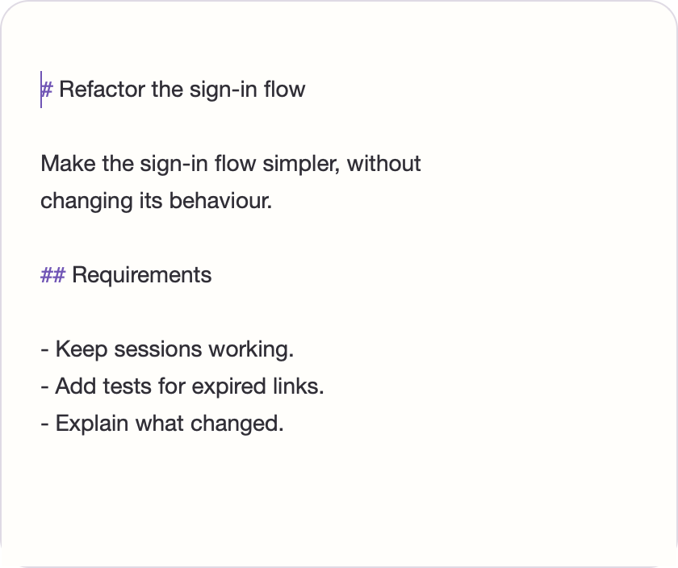
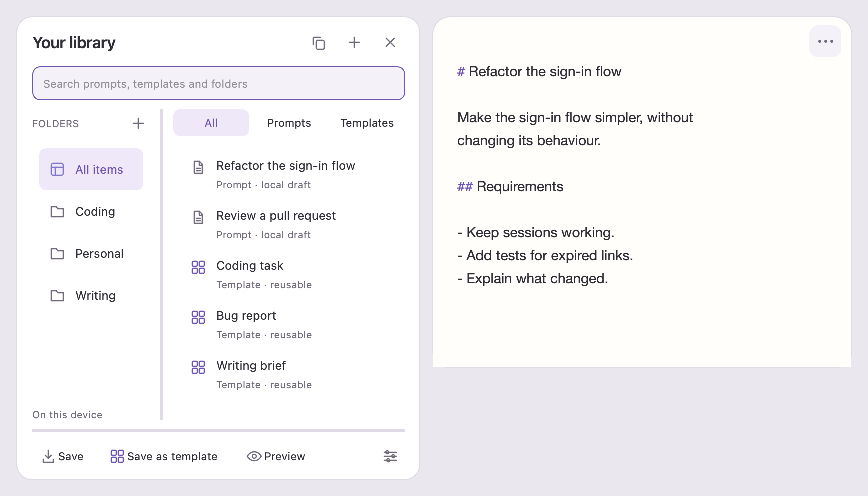
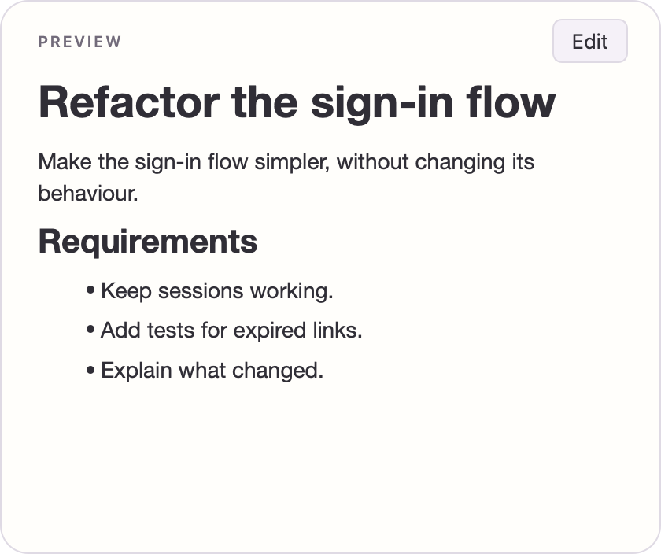

# PromptPad

**A quiet, native place to write long prompts for coding tools.** PromptPad edits ordinary Markdown and text files for tools such as Codex and Claude Code. It does not call AI, run agents, send prompts to a service, or require an account.

Built with C++20, Qt 6 Widgets, upstream Scintilla and Lexilla. Documents remain plain UTF-8 files; SQLite stores local drafts, templates, snippets and checkpoints.



| Library beside the editor | Markdown preview |
| --- | --- |
|  |  |

[Dark appearance](docs/screenshots/figma-native-editor-dark.png) · [Blank launch](docs/screenshots/figma-native-blank-light.png) · [Library snapped left](docs/screenshots/window-management/library-left.png) · [Library above](docs/screenshots/window-management/library-top.png) · [Library below](docs/screenshots/window-management/library-bottom.png) · [Contextual formatting](docs/screenshots/figma-format-light.png)

These captures come from the running Qt app with synthetic prompts and temporary profiles. The writing, library and preview captures use native macOS Cocoa rendering. The formatting menu capture uses Qt's offscreen platform because macOS draws a native popup outside a widget grab.

## Why PromptPad

- **Write immediately.** A small floating editor opens to a focused blank draft. There is no dashboard, permanent sidebar or setup flow.
- **Keep the source intact.** Scintilla owns the live buffer and undo history. Preview is optional and never replaces editable text. Existing UTF-8 BOM and newline bytes are preserved where possible.
- **Recover work locally.** Draft backups and explicit file saves are separate operations. File saves use atomic replacement and check for external changes before overwriting.
- **Find material when needed.** The pop-out library shows real folders, drafts and reusable templates, with search and filters. A template opens as an independent draft.
- **Move the workspace.** Drag the editor by its top strip and resize it at any edge or corner. Drag the library by its title row; drop near any editor side to snap, or choose a side in Library settings. Placement is remembered.
- **Hand text to another tool.** Copy the entire source as plain text, or invoke PromptPad as an external editor with `--wait`. It never connects to the AI tool itself.

Other available tools include find and replace, heading navigation, section actions, wrapping, multiple selections, keyboard formatting, snippets, checkpoints, light/dark appearance and a split Markdown preview. Optional interfaces open only when requested.

## Get PromptPad

Download the [PromptPad 0.1.0 macOS Apple Silicon preview](https://github.com/aaravchour/PromptPad/releases/tag/v0.1.0), or build from source below. The release includes a SHA-256 checksum. Unzip the archive and open `PromptPad.app`. The bundle is ad-hoc signed, not notarised or Developer ID signed; macOS may prevent opening it under normal Gatekeeper settings. Windows and Linux binaries have not been verified.

### macOS source build

Requires macOS on Apple Silicon, Xcode Command Line Tools, CMake 3.24+, Ninja and Qt 6.6+ with Core, Widgets, Network, Sql, Concurrent, Core5Compat and Svg modules. The observed build used Qt 6.11.2 from Homebrew.

```sh
brew install qtbase qt5compat qtsvg ninja
PATH=/opt/homebrew/bin:$PATH cmake --preset release -DCMAKE_PREFIX_PATH=/opt/homebrew
PATH=/opt/homebrew/bin:$PATH cmake --build --preset release -j 1
open build/release/promptpad.app
```

`-j 1` keeps peak compiler memory modest while building the vendored editor libraries. To see launcher errors, run `build/release/promptpad.app/Contents/MacOS/promptpad` from a terminal.

To make a self-contained Apple Silicon bundle, run `PATH=/opt/homebrew/bin:$PATH scripts/package-macos.sh`. This creates `dist/PromptPad.app`, includes the observed third-party licence files, and signs it ad hoc. It is not notarised or Developer ID signed. Review the [third-party notices](THIRD_PARTY_NOTICES.md) and the exact dependency inventory when changing build dependencies.

### Linux and Windows

Install a C++20 compiler, CMake 3.24+, Ninja, the Qt 6.6+ development modules above, and the Qt SQLite driver. Point CMake at Qt if it is outside the default search path:

```sh
cmake --preset release -DCMAKE_PREFIX_PATH=/path/to/Qt
cmake --build --preset release
ctest --test-dir build/release --output-on-failure
```

The [CI workflow](.github/workflows/build.yml) is configured for macOS, Ubuntu and Windows. Configuration alone does not establish a native manual pass or a distributable binary.

## Use the editor

| Task | Where |
| --- | --- |
| New, Open, Save, Save As | File menu and standard platform shortcuts |
| Copy every source character, including folded sections | Edit → Copy Entire Prompt |
| Search or replace | Edit → Find / Find and replace |
| Format a selection | Right-click or `Shift+F10`; bold, italic and underline shortcuts |
| Navigate or rearrange headings | Section menu; `Ctrl+Shift+O` opens the outline |
| Open the library | Hover/focus the top-right button or press `Ctrl/Cmd+.` |
| Snap or detach the library | Drag its title row, or Library settings → Library position |
| Switch Editor / Preview / Split Preview | View menu or `Ctrl+Alt+1/2/3`; **Edit** or Escape leaves full Preview |
| Change writing width, wrap, font or appearance | View menu |
| Open snippets, checkpoints or the command palette | Tools menu |

The menus show the platform's interpreted shortcuts. Preview renders Markdown locally, blocks external resources and links, and executes no scripts. It does not render diagrams or mathematics.

### Local external-editor hand-off

```sh
build/release/promptpad.app/Contents/MacOS/promptpad /path/to/prompt.md
build/release/promptpad.app/Contents/MacOS/promptpad --new
build/release/promptpad.app/Contents/MacOS/promptpad --wait /path/to/prompt.md
```

`--wait` can begin with a missing file. Use **File → Save and return** to write it and signal success. Closing the draft or app cancels the waiting caller. Separate callers can wait on separate files; a second waiter for the same open document is rejected. The running instance is reused through a per-user local socket, with no TCP server. Tools that support a blocking external editor can invoke `--wait`; copying plain text works with any tool.

## Files, recovery and privacy

PromptPad edits UTF-8 plain text and Markdown, with or without a UTF-8 BOM. It rejects binary, NUL-containing and invalid UTF-8 input. New drafts use LF line endings; existing newline bytes are retained unless edited. Saving to a symbolic-link destination is rejected. If another program changes an open file, PromptPad warns before saving and offers Save As.

Draft backups, SQLite metadata, snippets and checkpoints live under Qt's per-user application data directory. On macOS this is normally under `~/Library/Application Support/PromptPad/`; `PROMPTPAD_PROFILE_DIR` overrides the profile for isolated use and tests. Recovery storage is **not** the same as saving the original file. The app makes no network requests and has no telemetry; local storage is neither encrypted nor an off-device backup. Copying text places it on the system clipboard.

See [recovery and file behaviour](docs/recovery.md) for failure cases and [architecture](docs/architecture.md) for module ownership.

## Verification and known limits

Run all automated tests from a configured checkout:

```sh
PATH=/opt/homebrew/bin:$PATH ctest --test-dir build/release --output-on-failure
```

The macOS run on 25 September 2026 passed all five CTest targets, covering editing, UTF-8 and wrapped selections, undo, recovery, preservation, search, outline and concurrent `--wait` hand-offs. Focused Preview and window-management tests also passed on native Cocoa. The full native Cocoa smoke suite has test-order-sensitive focus and fold-readiness assertions; see the [manual checklist](docs/manual-checklist.md).

One warm-cache Release sample on an Apple M5 Mac measured:

| Scenario | Native Cocoa startup to editable | Steady physical footprint |
| --- | ---: | ---: |
| Blank editor | 156.1 ms | 23.71 MB |
| One 100,000-character prompt | 185.3 ms | 36.23 MB |

For the 100,000-character case, the native input-to-paint event proxy had a 1.32 ms p95 over 100 edits. These samples are measurements, not hardware-independent promises or physical display latency. Larger stress cases, previous measurements and methodology are in [performance notes](docs/performance.md).

The macOS app is not notarised. A physical pointer, IME, screen reader, display-scaling and long-session pass remains to be completed. Very small screens may not fit the editor and library at their minimum sizes on a requested side. Native Windows and Linux passes remain open.

## Contributing and licence

Read [CONTRIBUTING.md](CONTRIBUTING.md) before changing editing, persistence or IPC code. The application source is [MIT licensed](LICENSE). Scintilla, Lexilla, Qt and bundled dependencies retain their own licences; see [THIRD_PARTY_NOTICES.md](THIRD_PARTY_NOTICES.md). The private design brief and reference image used during development are not part of the public source release.
